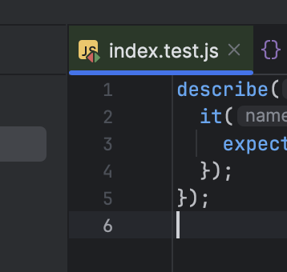
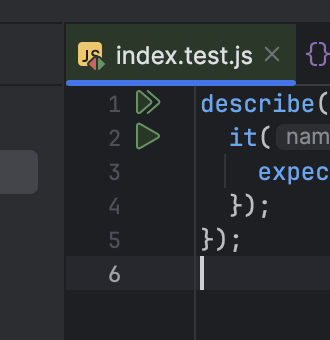

### To reproduce:

1. `cd main`
2. `yarn`
3. Open `main` in IntelliJ
4. Open `index.test.js`
5. Note missing test gutter icons

    

6. Change `package.json` so that `proxy: ...` is replaced with `"jest": "^29.7.0"`, run `yarn`
7. Note that test gutter icons are back

    

8. Revert your change, then modify the `@playwright/test` to have any other name, like `@playwright/test-edited`
9. Again, test gutter icons are back
